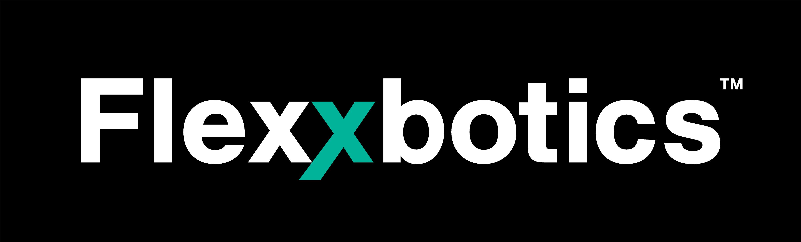

# Flexxbotics Transformers
**Industrial Device & Workcell Transformers for the FlexxCore Platform**


---

<p align="center">
  
</p>

## Overview

This repository is home to **open-source industrial transformers** compatible with **FlexxCore**, the runtime platform at the core of the **Flexxbotics Smart Factory and Workcell Automation system**.

In FlexxCore architecture, a **Transformer** is the software component responsible for **communicating with equipment**. Transformer methods become the runtime execution points for:

- Status reads  
- Variable reads and writes  
- Commands  
- Polling logic  
- Automation behavior  

> This repository contains **industrial automation transformers** — not machine learning or NLP transformers.

Flexxbotics Transformers enable **many-to-many interoperability** across heterogeneous industrial equipment, allowing robots, CNCs, PLCs, inspection systems, and workcells to operate together through a common runtime and API.

---

## Key Characteristics

- Transformers are **loaded into the Flexxbotics runtime** to operate
- Each transformer abstracts vendor-specific protocols behind a standardized interface
- Every transformer added to a runtime is **automatically compatible with all others**
- Transformers are implemented in **Python**
- You can use **any Python IDE** to develop, extend, or debug transformers

---

## Core FlexxCore Concepts (Developer Guide Aligned)

FlexxCore is built around **Devices** and **Transformers**, with supporting concepts such as **Machine Models**, **Protocols**, **Extensions**, **Adapters**, and **Scripts**.

### Devices
A **Device** is the top-level runtime object representing physical or logical equipment, such as:
- Robots
- PLCs
- CNC machines
- Safety systems
- Inspection systems
- Complete workcells

Devices are created in the Flexxbotics UI and are assigned a **Machine Model**, which determines which transformer is used for communication.

---

### Transformers
A **Transformer** is the software component responsible for communicating with equipment.

Each transformer includes:
- A JSON definition (metadata, Python file name, class name)
- A Python implementation
- Runtime methods mapped directly to the Device API

When a device is instantiated, its transformer is instantiated in the runtime and bound directly to that device.

---

### Machine Models
Machine Models act as the **configuration layer** that binds physical equipment to a transformer.

Machine model definitions specify:
- OEM
- Equipment model
- Controller type
- Transformer assignment

---

## Conceptual Architecture (Runtime Execution)

> This diagram is a **conceptual representation** of FlexxCore runtime execution.

```text
┌────────────────────────┐
│   Physical Equipment   │
│ (Robot, PLC, CNC, CMM) │
└───────────┬────────────┘
            │
            ▼
┌────────────────────────┐
│   Protocol / SDK Layer │
│ (TCP, OPC-UA, OEM API) │
└───────────┬────────────┘
            │
            ▼
┌────────────────────────┐
│      Transformer       │
│  - Status Reads        │
│  - Variables           │
│  - Commands            │
│  - Polling Logic       │
└───────────┬────────────┘
            │
            ▼
┌────────────────────────┐
│         Device         │
│   Runtime Object       │
└───────────┬────────────┘
            │
            ▼
┌────────────────────────┐
│    FlexxCore Device    │
│           API          │
└────────────────────────┘
```

## Tags / Keywords

industrial automation · robotics · workcell automation · CNC · PLC · CMM ·  
industrial protocols · factory automation · smart factory · robot integration ·  
FlexxCore · Flexxbotics · Python automation
